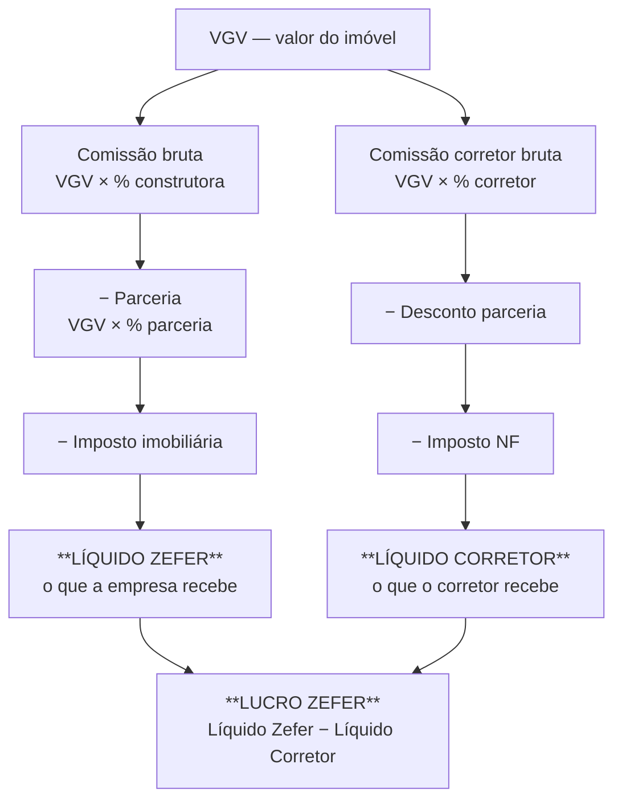

# Sistema Financeiro Zefer — Documentação

> Documento de referência do sistema: o que é, como está montado e como cada
> parte funciona. Escrito para quem opera o sistema e para quem dá manutenção no
> código. Última revisão: julho/2026.

---

## Sumário

1. [Visão geral](#1-visão-geral)
2. [Como o dinheiro flui (o modelo mental)](#2-como-o-dinheiro-flui-o-modelo-mental)
3. [Tecnologia e arquitetura](#3-tecnologia-e-arquitetura)
4. [O motor de cálculo (`lib/calculos.ts`)](#4-o-motor-de-cálculo-libcalculosts)
5. [Módulos, tela a tela](#5-módulos-tela-a-tela)
6. [Percentuais por mês](#6-percentuais-por-mês)
7. [Banco de dados](#7-banco-de-dados)
8. [Perfis de acesso e segurança](#8-perfis-de-acesso-e-segurança)
9. [Ciclo de vida de uma venda (ponta a ponta)](#9-ciclo-de-vida-de-uma-venda-ponta-a-ponta)
10. [Como rodar e publicar](#10-como-rodar-e-publicar)
11. [Decisões e regras não óbvias](#11-decisões-e-regras-não-óbvias)

---

## 1. Visão geral

O Sistema Financeiro Zefer é um aplicativo web que substitui as planilhas da
imobiliária. Ele controla toda a vida financeira de uma venda — da comissão paga
pela construtora até o pagamento do corretor — e também o financeiro da própria
empresa (caixa, custos, despesas, investimentos).

- **Interface:** português do Brasil, moeda R$, tema preto + dourado (identidade Zefer).
- **Produção:** <https://financeiro.grupozefer.com> (hospedado na Vercel).
- **Repositório:** github.com/HyagoHMdev/zeferfinanceiro (branch `main`).
- **Banco/Autenticação:** Supabase.

O sistema tem uma ideia central: **existe um único lugar onde a matemática
financeira acontece** (o arquivo `lib/calculos.ts`). Formulários, gravações no
banco e relatórios usam essa mesma função, então o número nunca diverge entre uma
tela e outra.

---

## 2. Como o dinheiro flui (o modelo mental)

Toda venda gera duas "pontas" a partir do **VGV** (Valor Geral de Venda, o valor
do imóvel):



Em uma frase: a construtora paga uma comissão sobre a venda; dela saem a parceria
(se houver), os impostos e a parte do corretor; o que sobra é o lucro da Zefer.

---

## 3. Tecnologia e arquitetura

| Camada | O que usamos |
| --- | --- |
| Framework | **Next.js 16** (App Router, TypeScript) |
| Renderização | **Server Components** + **Server Actions** (a lógica sensível roda no servidor) |
| Banco / Auth / Arquivos | **Supabase** (Postgres + Auth e-mail/senha + Storage), com **RLS** (segurança por linha) |
| Acesso ao banco | `@supabase/ssr` |
| Estilo | **Tailwind CSS v4** + componentes shadcn/ui (Radix) montados à mão |
| Gráficos | **Recharts** |
| Testes | **Vitest** |
| Deploy | **Vercel** (redeploy automático a cada `git push`) |

**Como as peças se encaixam:**

- **Páginas** (`app/(app)/…/page.tsx`) são Server Components: rodam no servidor,
  buscam dados e entregam HTML pronto.
- **Funções de dados** (`lib/data/*.ts`) concentram as consultas ao banco (leitura).
- **Server Actions** (`app/(app)/…/actions.ts`) fazem as gravações (criar,
  editar, excluir), sempre validando o perfil do usuário antes.
- **Componentes client** (marcados com `"use client"`) cuidam de interações:
  formulários, diálogos, filtros, dropdowns de status.
- **`lib/calculos.ts`** é a fonte única de verdade dos cálculos, usada tanto no
  cliente (prévia ao digitar) quanto no servidor (gravação).

A segurança é aplicada em **duas camadas**: nos Server Actions (checagem de
perfil) e no próprio banco (políticas RLS). Mesmo que algo passasse pela
aplicação, o banco recusaria.

---

## 4. O motor de cálculo (`lib/calculos.ts`)

Todo o cálculo de uma venda vive em uma função só: **`calcularVenda`**. Ela é
pura (não depende de tela nem de banco), então pode ser reusada em qualquer lugar
e testada isoladamente com Vitest.

### Regra de arredondamento

As planilhas originais calculam a cadeia inteira em **precisão total** e só
arredondam na exibição. O sistema faz igual: calcula tudo com os valores brutos e
aplica `round2()` **apenas nos campos finais**. `round2` usa "arredondamento para
cima no meio, afastando do zero" (igual ao `ROUND` do Excel), com um pequeno
ajuste para corrigir erros de ponto flutuante. Isso evita divergências de
centavos com as planilhas antigas.

### A cadeia da venda

**Lado da imobiliária (Zefer):**

```
comissão bruta        = VGV × % construtora
valor da parceria     = VGV × % parceria           (base = VGV; só se há parceria)
líquido pós-parceria  = comissão bruta − valor da parceria
imposto               = líquido pós-parceria × % imposto imobiliária
LÍQUIDO ZEFER         = líquido pós-parceria − imposto
```

**Lado do corretor:**

```
comissão corretor bruta   = VGV × % corretor
desconto do corretor      = comissão corretor bruta × % desconto   (só se há parceria)
comissão corretor ajust.  = comissão corretor bruta − desconto
imposto NF                = comissão corretor ajustada × % imposto NF
LÍQUIDO CORRETOR          = comissão corretor ajustada − imposto NF
```

**Resultado da empresa:**

```
LUCRO ZEFER = LÍQUIDO ZEFER − LÍQUIDO CORRETOR
```

### Outras funções do arquivo

- **`calcularDistribuicao`** — para as entradas: calcula dízimo, líquido e a
  divisão Empresa/Pessoal (`dízimo = valor × %dízimo`; `líquido = valor − dízimo`;
  `empresa = líquido × %empresa`; `pessoal = líquido − empresa`).
- **`resumoCorretor`** — líquido para pagamento do corretor = líquido do corretor
  − adiantamentos.
- **`calcularSaldoCorretor`** — extrato do corretor = comissões a receber +
  bonificações − adiantamentos.
- **`round2`, `percentParaFracao`, `fracaoParaPercent`** — utilitários.

> **Observação importante sobre percentuais:** internamente o sistema guarda os
> percentuais como **fração** (5% = `0.05`). A conversão para/de o número que o
> usuário digita (5, 1,75…) acontece nas bordas (formulário).

---

## 5. Módulos, tela a tela

### Vendas (`/vendas`)
Cadastro da venda em três blocos — **Dados da venda** (construtora,
empreendimento, unidade/torre, dados do cliente), **Parceria** (via cadastro de
parceiros) e **Valores** — com um painel que calcula ao vivo até o Líquido Zefer.
A lista mostra as vendas com status (Aguardando recebimento / Recebido / Pago)
alterável inline. **Ao cadastrar uma venda, o sistema automaticamente cria uma
Entrada** com o valor do Líquido Zefer e marca a venda como Recebido.

### Corretores (`/corretores`)
Gestão das comissões **por venda**. A lista mostra a comissão de cada venda com o
status de pagamento (**Aguardando liberação / Pago**), alterável inline. Em
`/corretores/[vendaId]` você processa uma comissão: vê os dados da venda,
ajusta os percentuais do corretor (comissão, desconto de parceria, imposto NF),
lança **adiantamentos daquela venda** e vê o resumo → Líquido para pagamento.
O corretor logado vê a própria visão em **`/meu-extrato`**.

### Pagamentos (`/pagamentos`)
Onde as comissões viram **pagamento efetivo ao corretor**, com recibo.

- **A pagar:** agrupa, por corretor, todas as comissões com status *Aguardando
  liberação* e os adiantamentos ainda não quitados daquelas vendas. Mostra
  bruto, adiantamentos e líquido a pagar.
- **Registrar pagamento:** um diálogo mostra o detalhamento e, ao confirmar,
  o sistema (a) cria um registro em `pagamentos_corretor`, (b) marca aquelas
  comissões como **Pago**, e (c) vincula comissões e adiantamentos ao pagamento.
  Em seguida abre o **recibo imprimível** (`/recibo/pagamento/[id]`).
- **Pagamentos realizados:** histórico, com link para o recibo e opção de
  **estornar** (devolve as comissões para "aguardando liberação" e remove o
  pagamento; os adiantamentos são apenas desvinculados, não excluídos).
- Os valores são **recalculados no servidor** na hora de gravar — o sistema não
  confia nos números que vieram da tela.

### Entradas (`/entradas`)
Todo dinheiro que entra: comissão (gerada pela venda), bonificação, premiação,
investidor, outras. Cada entrada tem **dízimo** e a divisão **% Empresa / %
Pessoal** (que precisa somar 100%). A tabela mostra o "caminho" do valor da venda
(bruto → pós-imposto → pós-corretor → líquido, já com dízimo). Filtro por tipo.

### Financeiro (`/financeiro`)
Seis abas de lançamentos e caixa:

- **Caixa** — saldo atual e previsto (Empresa e Pessoal). Tem **filtro de mês**
  com dois modos: *Movimento do mês* (só o que entrou/saiu naquele mês) ou
  *Acumulado até o mês* (saldo corrente até o fim do mês escolhido).
- **Fluxo de Caixa** — entradas e saídas da empresa, mês a mês, no ano.
- **Custos Fixos / Despesas Variáveis / Investimentos / Pessoal** — lançamentos
  com **recorrência** (cada ocorrência tem seu próprio vencimento, ajustado ao
  último dia do mês quando necessário; ao editar/excluir você escolhe "somente
  este" ou "todos do grupo"), filtro dinâmico (busca/mês/categoria/status),
  status colorido (verde/amarelo/vermelho) e "atrasado" automático quando o
  vencimento passa. Cada lançamento tem um campo livre de **Observações** (ex.:
  chave PIX). A lista fica ordenada com o **mês atual e os futuros no topo** e os
  meses passados no fim.

### Dashboard (`/dashboard`)
Indicadores gerais (receita, comissões recebidas/pendentes, pago a corretores,
despesas fixas/variáveis, resultado, saldo em caixa) e o gráfico **Receita ×
Despesa**. Tem **filtro de ano + mês**: os KPIs recalculam para o período
escolhido; o gráfico sempre mostra o ano inteiro (Jan–Dez) do ano selecionado.

### Relatórios (`/relatorios`)
Por corretor, por construtora, por empreendimento, Fluxo de Caixa e DRE
Simplificado.

### Configurações (`/configuracoes`) — só Administrador
- **Parâmetros:** percentuais padrão e valores globais por mês.
- **Cadastros:** construtoras, empreendimentos, corretores, parceiros, contas
  bancárias, centros de custo, fornecedores, categorias — com percentuais por mês
  por entidade.
- **Usuários:** perfis de acesso.

---

## 6. Percentuais por mês

Praticamente todo percentual pode variar de mês para mês (tabela
`percentuais_mensais`): comissão da construtora, comissão do corretor, repasse do
parceiro, imposto NF, imposto da imobiliária e dízimo.

A busca segue uma **cascata**: primeiro procura o valor **daquele mês**; se não
houver, usa o **padrão do cadastro** (ex.: da construtora); se ainda não houver,
usa o **padrão global**. E, na tela da venda, qualquer percentual continua
editável na mão.

---

## 7. Banco de dados

As mudanças de estrutura ficam em `supabase/migrations/`, aplicadas em ordem:

| Migração | O que traz |
| --- | --- |
| `0001_schema` | Tabelas, enums, índices e gatilhos base |
| `0002_rls` | Funções de perfil e políticas de segurança (RLS) |
| `0003_storage` | Bucket de anexos |
| `0004_percentuais_mensais` | Percentuais por mês |
| `0005_refatoracao_financeiro` | Parceria (modelo manual), status de pagamento do corretor **por venda**, adiantamento por venda |
| `0006_venda_cliente` | Torre, nascimento e telefone do cliente na venda |
| `0007_lancamento_observacoes` | Campo de observações no lançamento (ex.: PIX) |

**Principais tabelas:** `vendas`, `corretores`, `construtoras`, `empreendimentos`,
`parceiros`, `adiantamentos`, `pagamentos_corretor`, `entradas` + `distribuicoes`,
`lancamentos`, `categorias/contas/centros/fornecedores`, `configuracoes`,
`percentuais_mensais`, `profiles`.

> Para configurar um banco do zero existe o arquivo combinado
> `supabase/_setup_completo.sql`.

**Sobre pagamento do corretor (importante para entender o histórico):** o modelo
atual é **por venda** — cada venda tem `status_pagamento_corretor`
(*aguardando_liberacao* / *pago*). A tabela agregada `pagamentos_corretor` (com
recibo) é usada pela aba **Pagamentos** para consolidar várias comissões em um
pagamento só e gerar o recibo.

---

## 8. Perfis de acesso e segurança

Quatro perfis:

| Perfil | O que pode |
| --- | --- |
| **Administrador** | Tudo, incluindo Configurações |
| **Financeiro** | Opera o dia a dia (vendas, corretores, pagamentos, financeiro) |
| **Diretor** | Leitura e relatórios |
| **Corretor** | Apenas o próprio extrato (`/meu-extrato`) |

O menu lateral já mostra só o que o perfil pode acessar. Além disso, cada
gravação passa por uma checagem de perfil no servidor **e** pelas políticas RLS
no banco — um corretor, por exemplo, só consegue ler as próprias comissões, mesmo
que tentasse acessar direto.

---

## 9. Ciclo de vida de uma venda (ponta a ponta)

```mermaid
flowchart LR
    A[1. Cadastra a venda<br/>/vendas] --> B[2. Entrada automática<br/>= Líquido Zefer<br/>venda vira 'Recebido']
    B --> C[3. Ajusta comissão do corretor<br/>/corretores/&#91;venda&#93;]
    C --> D[4. Libera/paga a comissão<br/>/pagamentos → recibo]
    D --> E[5. Aparece em Dashboard,<br/>Caixa e Relatórios]
```



1. **Cadastro da venda** — você informa VGV, construtora, corretor, parceria e os
   percentuais. O painel calcula tudo ao vivo (fonte: `calcularVenda`).
2. **Entrada automática** — ao salvar, o sistema cria uma Entrada com o Líquido
   Zefer e marca a venda como *Recebido*. Essa entrada alimenta Caixa e Dashboard.
3. **Comissão do corretor** — em Corretores você confere/ajusta os percentuais do
   corretor e lança adiantamentos daquela venda, se houver.
4. **Pagamento** — em Pagamentos você consolida as comissões *aguardando
   liberação* do corretor, desconta os adiantamentos, registra o pagamento e
   imprime o recibo. As comissões passam a *Pago*.
5. **Visibilidade** — o resultado aparece no Dashboard (indicadores e gráfico),
   no Caixa e nos Relatórios.

---

## 10. Como rodar e publicar

```bash
npm run dev        # ambiente local (usa .env.local apontando para o Supabase)
npm run build      # build de produção
npm run lint       # análise estática
npm run typecheck  # checagem de tipos (TypeScript)
npm test           # testes (Vitest)
```

**Publicar:** um `git push` na branch `main` dispara o redeploy automático na
Vercel. **Migrações de banco** são aplicadas à parte no Supabase (via SQL Editor
ou ferramenta de migração) — o código e o banco precisam estar sincronizados:
quando um deploy depende de uma coluna nova, aplique a migração **antes** de o
código novo entrar no ar.

---

## 11. Decisões e regras não óbvias

- **A parceria incide sobre o VGV**, não sobre a comissão bruta. Por isso os
  percentuais de parceria são pequenos (~1%).
- **O "% comissão" do corretor é o que ele ganha** (ex.: 1,75%). Se ficar igual
  ao % da construtora, o **Lucro Zefer zera** — vale conferir no cadastro.
- **A entrada automática da venda usa o Líquido Zefer** (após imposto), não a
  comissão bruta.
- **"Atrasado" é visual/derivado**: no banco o lançamento continua *pendente* até
  ser marcado como pago; a tela mostra "atrasado" quando o vencimento passou.
- **Arredondamento só no fim**: a cadeia inteira é calculada em precisão total e
  só os campos finais são arredondados, para bater centavo a centavo com as
  planilhas.
- **Cálculo em um lugar só**: qualquer mudança na matemática deve ser feita em
  `lib/calculos.ts` — nunca replicada em telas ou actions.
- **Pagamento ao corretor é reversível**: o estorno em Pagamentos devolve as
  comissões para "aguardando liberação" sem apagar os adiantamentos.

---

*Dúvidas ou algo que mudou no código e não está aqui? Este documento fica em
`DOCUMENTACAO.md`, na raiz do repositório — mantenha-o junto com as alterações.*
